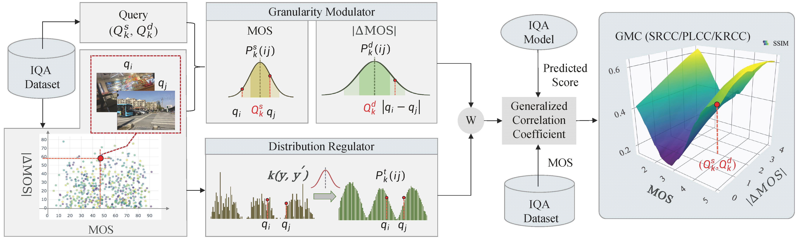
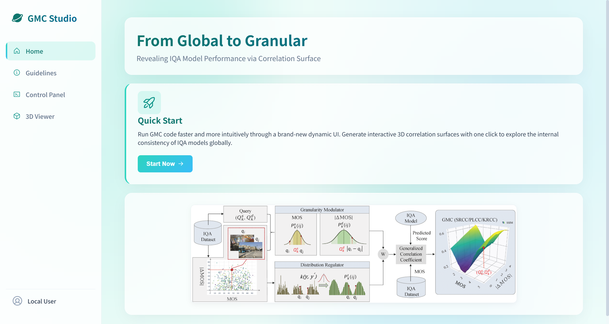
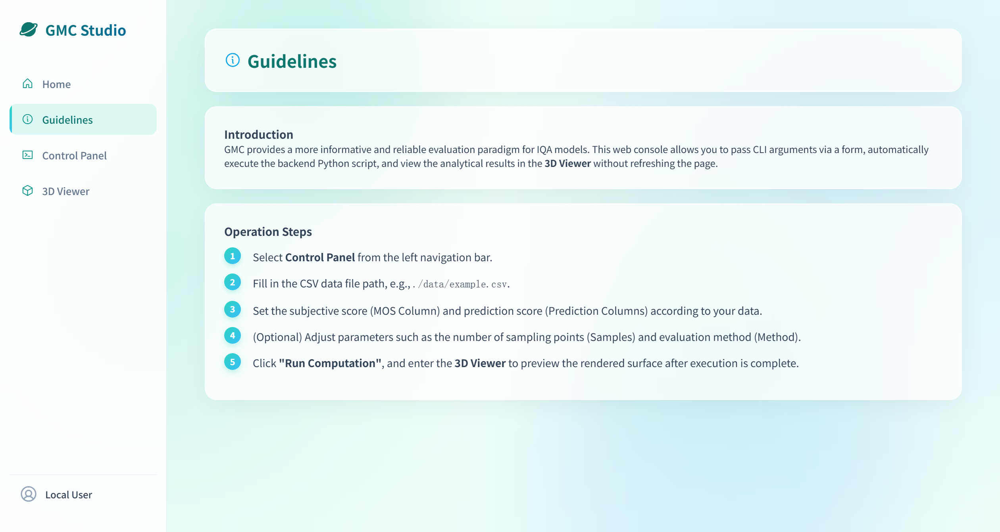
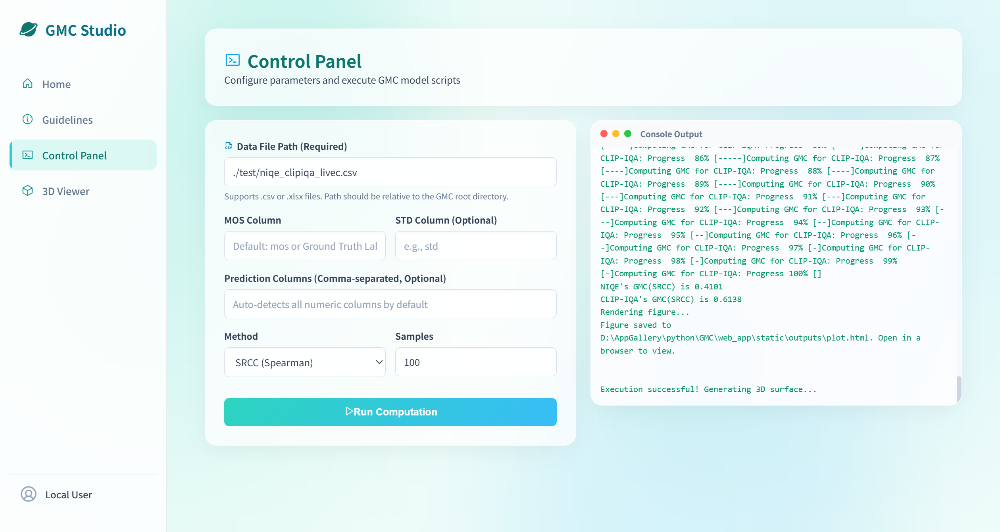
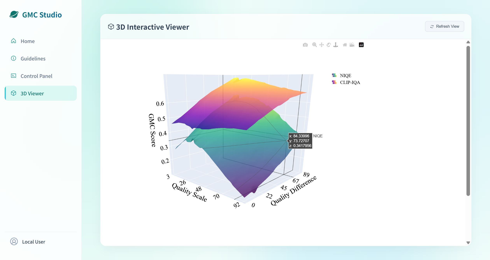

<div align="center">

<h1>From Global to Granular: Revealing IQA Model Performance via Correlation Surface</h1>

<div>
    <a href='https://scholar.google.com/citations?hl=zh-CN&user=w_WL27oAAAAJ' target='_blank'>Baoliang Chen</a><sup>1,2</sup>&emsp;
    <a href='' target='_blank'>Danni Huang</a><sup>1</sup>&emsp;
    <a href='https://dblp.org/pid/214/8898.html' target='_blank'>Hanwei Zhu</a><sup>2</sup>&emsp;
    <a href='https://github.com/lingyzhu0101' target='_blank'>Lingyu Zhu</a><sup>3</sup>&emsp;
    <a href='' target='_blank'>Wei Zhou</a><sup>4</sup>&emsp;
    <a href='' target='_blank'>Shiqi Wang</a><sup>3</sup>&emsp;
    <a href='' target='_blank'>Yuming Fang</a><sup>5</sup>&emsp;
    <a href='' target='_blank'>Weisi Lin</a><sup>2</sup>
</div>
<div>
    <sup>1</sup>South China Normal University, China&emsp; 
    <sup>2</sup>Nanyang Technological University, Singapore&emsp; 
    <sup>3</sup>City University of Hong Kong, China&emsp; 
    <sup>4</sup>Cardiff University, United Kingdom&emsp; 
    <sup>5</sup>Jiangxi University of Finance and Economics, China&emsp; 
</div>

<div>
    <h4 align="center">
        • <a href="https://github.com/Dniaaa/GMC" target='_blank'>[Code]</a> • 
        <a href="https://htmlpreview.github.io/?https://github.com/Dniaaa/GMC/blob/main/test/ssim_kadid10k.html" target='_blank'>[Try Interactive Demo]</a> •
    </h4>
</div>



<br>

<strong>The proposed Granularity-Modulated Correlation (GMC) measure reveals IQA model behavior through a structured correlation surface, providing a more informative and reliable paradigm for analyzing, comparing, and deploying IQA models.</strong>

</div>

---

## :bar_chart: Correlation Surface Visualization

<div align="left">

<table>
  <tr>
    <td width="55%">
        <strong>Interactive Performance Diagnosis:</strong><br>
        The GMC framework generates structured 3D surfaces that visualize IQA model consistency. Unlike traditional metrics that provide a single global score, our correlation surface reveals how model reliability fluctuates across different <b>Quality Scales</b> and <b>Quality Differences</b>. This granular view helps identify model weaknesses (e.g., failure in distinguishing high-quality images) that aggregated scalars might miss.
        <br><br>
        This tool integrates sampling, weight calculation (with/without STD), correlation computation (PLCC/SRCC/KRCC), and surface fitting into a single workflow.
    </td>
    <td width="45%" align="center">
        <a href="https://htmlpreview.github.io/?https://github.com/Dniaaa/GMC/blob/main/test/ssim_kadid10k.html">
            
        </a>
    </td>
  </tr>
</table>

</div>

> **Tip:** Click the link in the header or the interactive animation above to open the **full interactive 3D surface** in your browser.

---

## :hammer_and_wrench: Installation

### Environment Setup

Ensure you have Python 3.8+ installed.

```bash
# Clone the repository
git clone https://github.com/Dniaaa/GMC.git
cd GMC

# Install dependencies
pip install numpy pandas scipy statsmodels plotly openpyxl flask
```

---

## :rocket: Quick Start

Generate your own 3D correlation surface with a single command. The tool handles everything from data loading to interactive visualization.

### 1. Basic Usage (Auto-detection)

The tool will automatically detect MOS and prediction columns. If standard deviation (STD) is not provided, it will be estimated automatically.

```bash
python main.py --pred-file ./data/SPAQ/qualiclip.csv
```

### 2. Specify Columns

If your CSV has custom column names, you can point them out:

```bash
python main.py --pred-file ./data/SPAQ/qualiclip.csv \
  --pred-cols "Results Scores for CC" \
  --mos-col "Ground Truth Labels"
```

### 3. Advanced Usage (With STD & Weights)

For precise control, provide specific STD files or output paths:

```bash
python main.py --pred-file ./test/pred_ssim_kadid10k.csv \
               --weights-file ./results/kadid10k_Gauss/weights.txt \
               --sample-file ./results/kadid10k_Gauss/sample100.xlsx \
               --output ./test/ssim_kadid10k.html
```

---

## :gear: CLI Arguments & Parameters

| Parameter | Type | Default | Description |
| :--- | :--- | :--- | :--- |
| `--pred-file` | `str` | **Required** | Path to input data (CSV/XLSX). |
| `--pred-cols` | `str` | `""` | Comma-separated list of prediction columns. If empty, auto-detects numeric columns (excluding MOS/STD). |
| `--mos-col` | `str` | `"mos"` | Name of the MOS column. Also checks for "Ground Truth Labels". |
| `--std-col` | `str` | `""` | Name of the STD column in the input file (optional). |
| `--std-file` | `str` | `""` | Path to an external text file containing STD values (one per line). |
| `--weights-file` | `str` | `""` | Path to a weights file. If provided, skips weight calculation. |
| `--samples` | `int` | `100` | Number of Latin Hypercube Sampling (LHS) points. |
| `--method` | `str` | `"SRCC"` | Correlation type: `PLCC`, `SRCC`, or `KRCC`. |
| `--output` | `str` | `"results/3d/plot.html"` | Path to save the interactive HTML 3D plot. |
| `--std-scale` | `float`| `1.0` | Scaling factor for STD in correlation calculation. |
| `--ks` | `int` | `5` | Kernel window size for LDS smoothing (used if no STD). |
| `--sigma` | `float`| `2.0` | Gaussian kernel sigma for LDS smoothing. |

---

## :file_folder: Repository Structure & Modules

The codebase is modularized for clarity and extensibility:

- **[main.py](./main.py)**: The main entry point. Orchestrates data loading, weight calculation, sampling, and plotting.
- **[GMC.py](./GMC.py)**: Core logic for the Granularity-Modulated Correlation calculation.
- **[multi_surface.py](./multi_surface.py)**: Handles 3D surface fitting (Kernel Regression) and Plotly visualization.
- **[sampling.py](./sampling.py)**: Implements Latin Hypercube Sampling (LHS) to generate `(Q, Qd)` sample points.
- **[dataset_balance.py](./dataset_balance.py)**: Computes image weights using either Gaussian smoothing (if STD exists) or LDS (Label Distribution Smoothing).
- **[std_deviation.py](./std_deviation.py)**: Automatically estimates MOS standard deviation from data if not provided (using Beta distribution assumptions).
- **[utils.py](./utils.py)**: Helper functions for file I/O and kernel window generation.

---

## 🔄 Processing Workflow

1.  **Data Loading**: Reads CSV/XLSX. Auto-identifies MOS, STD, and Prediction columns via `autodetect_columns` in `main.py`.
2.  **STD Handling**:
    -   Uses `--std-file` if provided.
    -   Uses `--std-col` from the table if available.
    -   Otherwise, calls `estimate_std_from_mos` in `std_deviation.py`.
3.  **Weight Calculation**:
    -   Prefers `--weights-file`.
    -   If STD is valid, uses `cal_mos_weights_gaussian` (Gaussian smoothing).
    -   Otherwise, uses `cal_mos_weights` (LDS smoothing) in `dataset_balance.py`.
4.  **Sampling**: Generates `(Q, Qd)` points using Latin Hypercube Sampling in `sampling.py`.
5.  **GMC Calculation**: Iterates through sample points and methods to compute scores using `GMC` in `GMC.py`.
6.  **Visualization**: Fits a smooth surface over the computed scores using Kernel Regression and renders an interactive Plotly HTML file via `multi_surface.py`.

---

## 🎨 GMC Interactive Studio (✨ Brand New UI! ✨)

If you strictly hate typing commands inside black-box terminals—worry no more! We have developed a built-in **Flask based interactive Web Dashboard**. You can now execute and interact with everything dynamically via your web browser! 🎉

### 👉 How to Start
Make sure `flask` is installed (`pip install flask`), then launch the studio directly from the repository root:
```bash
python web_app/app.py
```
Open **`http://127.0.0.1:5000`** in any web browser to enjoy! 🚀

### 🌈 Guided Tour

> **1. Elegant Home Panel :house:**  
> It provides a high-level view of our "From Global to Granular" workflow paradigm.
> 
> 

> **2. Seamless User Guidelines :book:**  
> Never get lost! The step-by-step guidelines offer complete transparency on how to deploy parameters, upload CSV paths, and use the web control interface properly.
> 
> 

> **3. One-Click Control Panel & Console :joystick:**  
> The core magic happens here! Simply fill out your CSV paths and let the internal LHS sampling and GMC extraction compute. Watch the *macOS-style embedded terminal* on the right eagerly split out real-time backend analytical logs!
> 
> 

> **4. Captivating 3D Interactive Viewer :cube:**  
> After hitting "Run", your browser dynamically swops to an interactive *correlation surface canvas*. You can hold your mouse to zoom, rotate, and instantly pinpoint failure spots of different overlaid IQA models without leaving the application.
> 
> 

---

## :question: Troubleshooting

-   **Columns Not Found**: Ensure you specify `--mos-col` or `--pred-cols` if your CSV headers don't match defaults like "mos" or "std".
-   **Missing STD**: Not a problem! The tool will automatically estimate it. If you want to force specific STD values, use `--std-file`.
-   **Weight Calculation**: If you see unexpected results, check if the tool is using Gaussian (with STD) or LDS (without STD) weighting. You can view the logic in `dataset_balance.py`.

---

## :love_you_gesture: Citation

If you find this work useful for your research, please consider citing our paper:

```bibtex
@article{chen2024granular,
  title={From Global to Granular: Revealing IQA Model Performance via Correlation Surface},
  author={Chen, Baoliang and Huang, Danni and Zhu, Hanwei and Zhu, Lingyu and Wang, Shiqi and Lin, Weisi},
  journal={Submitted to IEEE Transactions on Pattern Analysis and Machine Intelligence (TPAMI)},
  year={2024}
}
```

## :envelope: Contact

For any questions, please feel free to reach out to:
- **Baoliang Chen**: [blchen6-c@my.cityu.edu.hk](mailto:blchen6-c@my.cityu.edu.hk)
- **Danni Huang**: [dannyhuang@m.scnu.edu.cn](mailto:dannyhuang@m.scnu.edu.cn)
